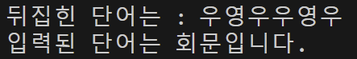
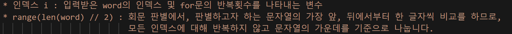
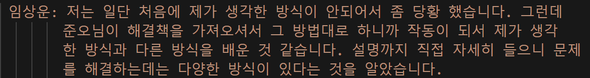

## AIFFEL Campus Online Code Peer Review Templete
- 코더 : 임상운
- 리뷰어 : 김기홍


## PRT(Peer Review Template)
- [v]  **1. 주어진 문제를 해결하는 완성된 코드가 제출되었나요?**
    - 문제에서 요구하는 결과물이 잘 첨부되었습니다.
    - 문제의 요구조건인 자료형, 제어문을 잘 활용하였습니다.
    - 결과물이 잘 작동하는 부분을 캡쳐해 근거로 첨부합니다.
    
    
- [v]  **2. 전체 코드에서 가장 핵심적이거나 가장 복잡하고 이해하기 어려운 부분에 작성된 
주석 또는 doc string을 보고 해당 코드가 잘 이해되었나요?**
    - 해당 코드블럭에 주석이 잘 작성되어있습니다.
    - 해당 코드가 무슨 기능을 하는지 잘 작성되어있습니다.
    - 주석을 보고 코드 이해가 잘 되었는지 확인
    - 잘 작성되었다고 생각되는 부분을 캡쳐해 근거로 첨부합니다.
    
        
- [v]  **3. 에러가 난 부분을 디버깅하여 문제를 “해결한 기록을 남겼거나” 
”새로운 시도 또는 추가 실험을 수행”해봤나요?**
    - 문제 원인 및 해결 과정을 잘 기록하였는지 확인
    - 문제에서 요구하는 조건에 더해 추가적으로 수행한 나만의 시도, 
    실험이 기록되어 있는지 확인

        
- [v]  **4. 회고를 잘 작성했나요?**
    - 주어진 문제를 해결하는 완성된 코드 내지 프로젝트 결과물에 대해
    배운점과 아쉬운점, 느낀점 등이 기록되어 있는지 확인
    - 전체 코드 실행 플로우를 그래프로 그려서 이해를 돕고 있는지 확인
    - 잘 작성되었다고 생각되는 부분을 캡쳐해 근거로 첨부합니다.
    
        
- [v]  **5. 코드가 간결하고 효율적인가요?**
    - 파이썬 스타일 가이드 (PEP8) 를 준수하였는지 확인
    - 하드코딩을 하지않고 함수화, 모듈화가 가능한 부분은 함수를 만들거나 클래스로 짰는지
    - 코드 중복을 최소화하고 범용적으로 사용할 수 있도록 함수화했는지
    - 잘 작성되었다고 생각되는 부분을 캡쳐해 근거로 첨부합니다.


## 참고 링크 및 코드 개선
```

# 잘 작성되었고, 새로운 방식으로 해결한 부분이 있어서 잘 배웠습니다.
# 함수를 넣으면 더 좋은 코드가 될 것 같습니다. 고생하셨습니다!

```
